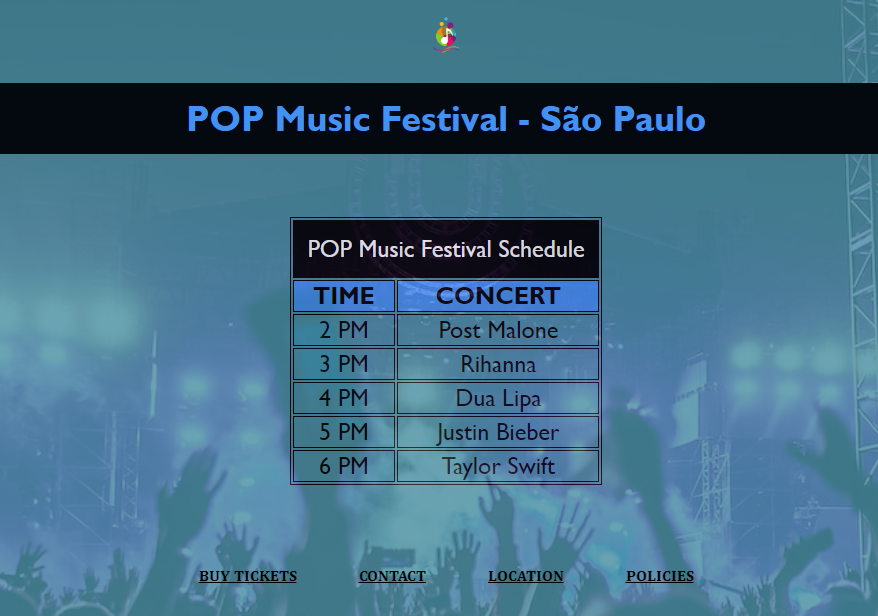

# POP Music Festival - São Paulo
Um projeto fictício de um festival de música pop em São Paulo, apresentado com HTML e CSS 🚀🎵
  
Desenvolvido como parte do curso de Front-End Engineer da CodeCademy.

## Visão Geral
Colocando em prática o aprendizado de tabelas e listas.
Este projeto simula o site de um festival de música pop fictício em São Paulo chamado "POP Music Festival", com informações sobre o cronograma do festival e links úteis.
Exercício proposto no curso de Front-End Engineer da CodeCademy.

## Preview e Acesso à página

Acesso à página: https://mariliatostesdev.github.io/music-festival-schedule/

## Tecnologias Utilizadas:
- HTML
- CSS
  
## Conteúdo

- [Visão Geral](#visão-geral)
- [Páginas](#páginas)
- [Estilo](#estilo)
- [Contato](#contato)
- [Tecnologias Utilizadas](#tecnologias-utilizadas)

## Páginas

1. **Home (`index.html`):** Apresenta o cronograma do festival com horários e artistas.

## Estilo

O projeto utiliza um arquivo CSS externo (`style.css`) para estilização. Algumas características de estilo incluem:

- Cores da paleta: #4392F1, #478DA0, #97D8B2, #4B644A, #04080F.
- Fundo da página principal com imagem de plano de fundo.

## Contato

- **Email:** mahtostes.dev@gmail.com
- **LinkedIn:** [LinkedIn - Marília Ribeiro Tostes](https://www.linkedin.com/in/marilia-ribeiro-tostes/)
- **Whatsapp:** [Fale comigo!](https://wa.me/5567981443147)
